# 📊 02. 시퀀스 다이어그램 (Sequence Diagrams)

### 다이어그램 목록

#### Admin (관리자)

| # | 시나리오 | 핵심 포인트 |
|---|---------|------------|
| 1 | 브랜드 등록 | 중복 검사, 유효성 검증 |
| 2 | 브랜드 삭제 | Cascade Soft Delete (하위 상품 숨김) |
| 3 | 상품 등록 | 옵션 포함, 원자적 저장 |

#### Member (회원) - 조회

| # | 시나리오 | 핵심 포인트 |
|---|---------|------------|
| 4 | 상품 목록 조회 | 필터링, 정렬, 삭제된 상품 제외 |
| 5 | 상품 상세 조회 | 옵션 목록, 품절 여부 표시 |
| 6 | 좋아요 목록 조회 | 삭제된 상품 제외 |
| 7 | 주문 내역 조회 | 스냅샷 데이터, 페이지네이션 |

#### Member (회원) - 좋아요/장바구니

| # | 시나리오 | 핵심 포인트 |
|---|---------|------------|
| 8 | 좋아요 토글 | 멱등성, 물리 삭제 |
| 9 | 장바구니 담기 | Merge 로직 (수량 합산) |
| 10 | 장바구니 조회 | 실시간 가격, 품절 상태 |

#### Member (회원) - 주문

| # | 시나리오 | 핵심 포인트 |
|---|---------|------------|
| 11 | 주문 생성 (장바구니) | 동시성 제어, 재고 차감, 스냅샷 |
| 12 | 주문 생성 (바로구매) | 단일 옵션 직접 주문 |
| 13 | 주문 취소 | 재고 복구, 상태 변경 |

### 레이어 책임

```
┌─────────────────────────────────────────────────────────────┐
│  Controller                                                 │
│  - 요청/응답 변환                                              │
│  - 인증 정보 추출                                              │
└─────────────────────────────────────────────────────────────┘
                              │
                              ▼
┌─────────────────────────────────────────────────────────────┐
│  Facade                                                     │
│  - 트랜잭션 경계 설정                                           │
│  - Repository 호출 및 조율                                     │
│  - 여러 Service 조합                                          │
└─────────────────────────────────────────────────────────────┘
                              │
                              ▼
┌─────────────────────────────────────────────────────────────┐
│  Service                                                    │
│  - 순수 비즈니스 로직                                            │
│  - 도메인 규칙 검증                                             │
│  - VO 메서드 활용                                              │
└─────────────────────────────────────────────────────────────┘
                              │
                              ▼
┌─────────────────────────────────────────────────────────────┐
│  Domain (Entity + VO)                                       │
│  - 데이터 + 불변식 보장                                         │
│  - VO 내부에 검증/로직 캡슐화                                    │
└─────────────────────────────────────────────────────────────┘
```

### 다이어그램 표기법

| 표기 | 의미 |
|------|------|
| `[조회]` | 데이터베이스에서 데이터 읽기 |
| `[저장]` | 데이터베이스에 데이터 쓰기 |
| `[삭제]` | 데이터베이스에서 데이터 제거 |
| `[락 획득]` | 동시성 제어를 위한 배타적 잠금 |

---

## 1. 브랜드 등록 - 관리자 (시나리오 A)

### 1.1 다이어그램

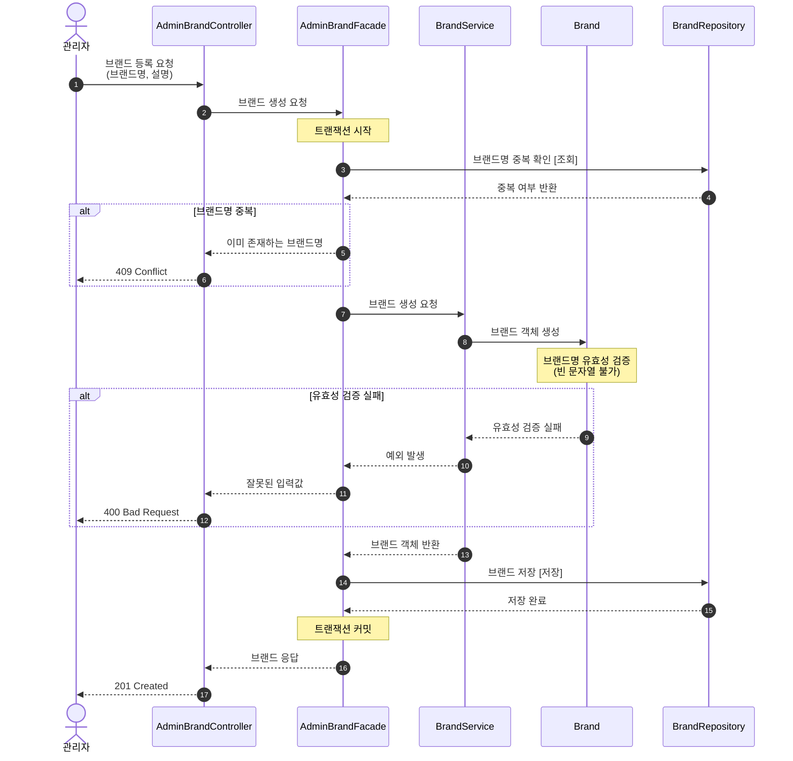
```mermaid
sequenceDiagram
    autonumber
    actor 관리자
    participant Controller as AdminBrandController
    participant Facade as AdminBrandFacade
    participant Service as BrandService
    participant Domain as Brand
    participant Repository as BrandRepository

    관리자->>Controller: 브랜드 등록 요청<br/>(브랜드명, 설명)
    Controller->>Facade: 브랜드 생성 요청

    Note over Facade: 트랜잭션 시작

    %% 1. 브랜드명 중복 검사
    Facade->>Repository: 브랜드명 중복 확인 [조회]
    Repository-->>Facade: 중복 여부 반환
    alt 브랜드명 중복
        Facade-->>Controller: 이미 존재하는 브랜드명
        Controller-->>관리자: 409 Conflict
    end

    %% 2. 도메인 객체 생성 및 유효성 검증
    Facade->>Service: 브랜드 생성 요청
    Service->>Domain: 브랜드 객체 생성
    Note over Domain: 브랜드명 유효성 검증<br/>(빈 문자열 불가)
    alt 유효성 검증 실패
        Domain-->>Service: 유효성 검증 실패
        Service-->>Facade: 예외 발생
        Facade-->>Controller: 잘못된 입력값
        Controller-->>관리자: 400 Bad Request
    end
    Service-->>Facade: 브랜드 객체 반환

    %% 3. 저장
    Facade->>Repository: 브랜드 저장 [저장]
    Repository-->>Facade: 저장 완료

    Note over Facade: 트랜잭션 커밋

    Facade-->>Controller: 브랜드 응답
    Controller-->>관리자: 201 Created
```

### 1.2 핵심 설계 포인트

| 단계 | 책임 객체 | 설명 |
|------|----------|------|
| 중복 검사 | Facade | 동일한 브랜드명 등록 방지 |
| 유효성 검증 | Domain (VO) | 브랜드명 빈 문자열 검증 |
| 트랜잭션 경계 | Facade | 원자적 저장 보장 |

---

## 2. 브랜드 삭제 - 관리자 (시나리오 C)

### 2.1 다이어그램

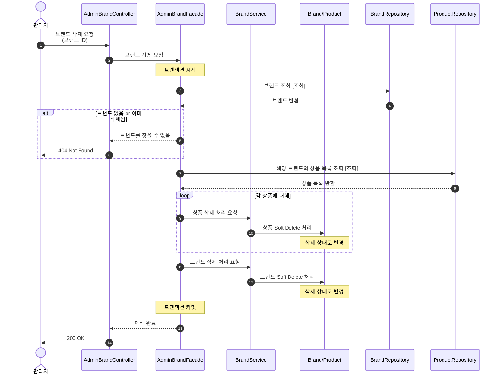
```mermaid
sequenceDiagram
    autonumber
    actor 관리자
    participant Controller as AdminBrandController
    participant Facade as AdminBrandFacade
    participant Service as BrandService
    participant Domain as Brand/Product
    participant BrandRepo as BrandRepository
    participant ProductRepo as ProductRepository

    관리자->>Controller: 브랜드 삭제 요청<br/>(브랜드 ID)
    Controller->>Facade: 브랜드 삭제 요청

    Note over Facade: 트랜잭션 시작

    %% 1. 브랜드 조회
    Facade->>BrandRepo: 브랜드 조회 [조회]
    BrandRepo-->>Facade: 브랜드 반환
    alt 브랜드 없음 or 이미 삭제됨
        Facade-->>Controller: 브랜드를 찾을 수 없음
        Controller-->>관리자: 404 Not Found
    end

    %% 2. 하위 상품 Cascade Soft Delete
    Facade->>ProductRepo: 해당 브랜드의 상품 목록 조회 [조회]
    ProductRepo-->>Facade: 상품 목록 반환

    loop 각 상품에 대해
        Facade->>Service: 상품 삭제 처리 요청
        Service->>Domain: 상품 Soft Delete 처리
        Note over Domain: 삭제 상태로 변경
    end

    %% 3. 브랜드 Soft Delete
    Facade->>Service: 브랜드 삭제 처리 요청
    Service->>Domain: 브랜드 Soft Delete 처리
    Note over Domain: 삭제 상태로 변경

    Note over Facade: 트랜잭션 커밋

    Facade-->>Controller: 처리 완료
    Controller-->>관리자: 200 OK
```

### 2.2 핵심 설계 포인트

| 단계 | 책임 객체 | 설명 |
|------|----------|------|
| Cascade 삭제 | Facade | 브랜드 삭제 시 하위 상품도 함께 삭제 |
| Soft Delete | Domain | 물리 삭제 대신 삭제 상태 플래그 변경 |
| 트랜잭션 경계 | Facade | 브랜드와 상품을 원자적으로 삭제 |

### 2.3 Cascade 삭제 전략

| 방식 | 장점 | 단점 |
|------|------|------|
| 즉시 Cascade (채택) | 데이터 정합성 보장 | 삭제 시 처리 비용 |
| 지연 Cascade | 삭제 성능 우수 | 정합성 관리 복잡 |

---

## 3. 상품 등록 - 관리자 (시나리오 B)

### 3.1 다이어그램

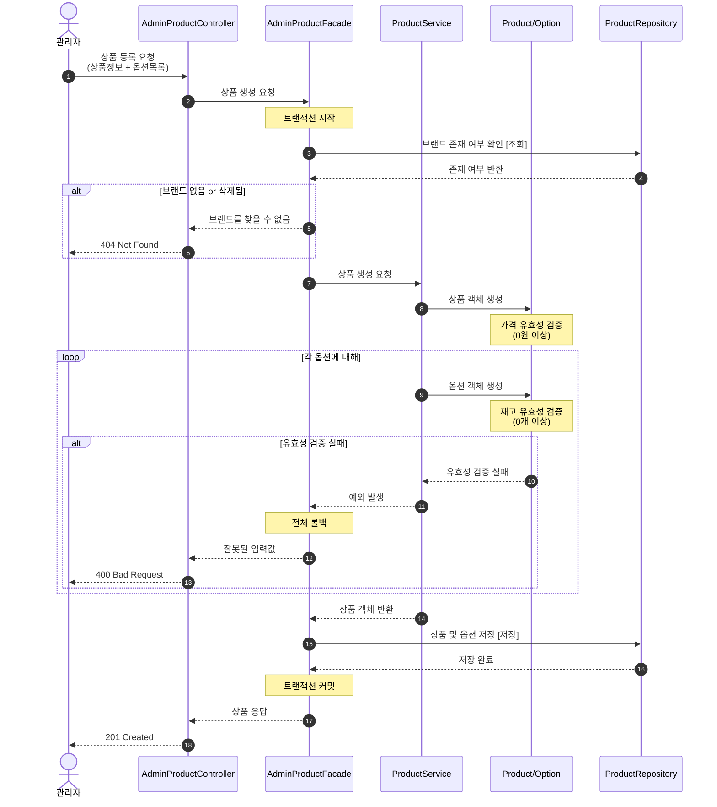
```mermaid
sequenceDiagram
    autonumber
    actor 관리자
    participant Controller as AdminProductController
    participant Facade as AdminProductFacade
    participant Service as ProductService
    participant Domain as Product/Option
    participant Repository as ProductRepository

    관리자->>Controller: 상품 등록 요청<br/>(상품정보 + 옵션목록)
    Controller->>Facade: 상품 생성 요청

    Note over Facade: 트랜잭션 시작

    %% 1. 브랜드 존재 확인
    Facade->>Repository: 브랜드 존재 여부 확인 [조회]
    Repository-->>Facade: 존재 여부 반환
    alt 브랜드 없음 or 삭제됨
        Facade-->>Controller: 브랜드를 찾을 수 없음
        Controller-->>관리자: 404 Not Found
    end

    %% 2. 도메인 객체 생성 및 유효성 검증
    Facade->>Service: 상품 생성 요청
    Service->>Domain: 상품 객체 생성
    Note over Domain: 가격 유효성 검증<br/>(0원 이상)

    loop 각 옵션에 대해
        Service->>Domain: 옵션 객체 생성
        Note over Domain: 재고 유효성 검증<br/>(0개 이상)
        alt 유효성 검증 실패
            Domain-->>Service: 유효성 검증 실패
            Service-->>Facade: 예외 발생
            Note over Facade: 전체 롤백
            Facade-->>Controller: 잘못된 입력값
            Controller-->>관리자: 400 Bad Request
        end
    end
    Service-->>Facade: 상품 객체 반환

    %% 3. 저장
    Facade->>Repository: 상품 및 옵션 저장 [저장]
    Repository-->>Facade: 저장 완료

    Note over Facade: 트랜잭션 커밋

    Facade-->>Controller: 상품 응답
    Controller-->>관리자: 201 Created
```

### 3.2 핵심 설계 포인트

| 단계 | 책임 객체 | 설명 |
|------|----------|------|
| 트랜잭션 경계 | Facade | 상품과 옵션을 원자적으로 저장 |
| 유효성 검증 | Domain (VO) | 가격/재고가 음수인 경우 생성 시점에 예외 |
| 브랜드 확인 | Facade | 존재하지 않는 브랜드에 상품 등록 방지 |

---

## 4. 상품 목록 조회 - 회원 (시나리오 D)

### 4.1 다이어그램

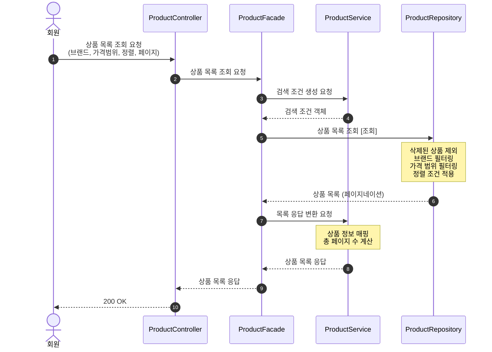
```mermaid
sequenceDiagram
    autonumber
    actor 회원
    participant Controller as ProductController
    participant Facade as ProductFacade
    participant Service as ProductService
    participant Repository as ProductRepository

    회원->>Controller: 상품 목록 조회 요청<br/>(브랜드, 가격범위, 정렬, 페이지)
    Controller->>Facade: 상품 목록 조회 요청

    %% 1. 필터 조건 생성
    Facade->>Service: 검색 조건 생성 요청
    Service-->>Facade: 검색 조건 객체

    %% 2. 상품 목록 조회
    Facade->>Repository: 상품 목록 조회 [조회]
    Note over Repository: 삭제된 상품 제외<br/>브랜드 필터링<br/>가격 범위 필터링<br/>정렬 조건 적용
    Repository-->>Facade: 상품 목록 (페이지네이션)

    %% 3. 응답 변환
    Facade->>Service: 목록 응답 변환 요청
    Note over Service: 상품 정보 매핑<br/>총 페이지 수 계산
    Service-->>Facade: 상품 목록 응답

    Facade-->>Controller: 상품 목록 응답
    Controller-->>회원: 200 OK
```

### 4.2 핵심 설계 포인트

| 단계 | 책임 객체 | 설명 |
|------|----------|------|
| 필터링 | Repository | 브랜드, 가격 범위 조건 적용 |
| Soft Delete 제외 | Repository | 삭제된 상품은 목록에서 제외 |
| 정렬 | Repository | 최신순, 가격순, 인기순 등 |
| 페이지네이션 | Repository | 오프셋 기반 페이지 처리 |

---

## 5. 상품 상세 조회 - 회원 (시나리오 D)

### 5.1 다이어그램

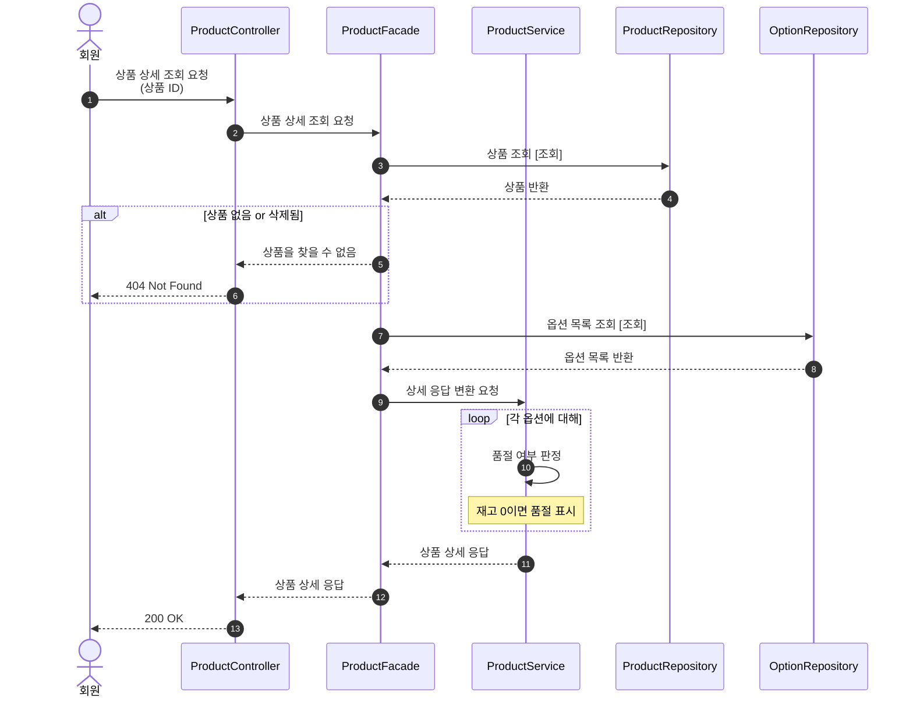
```mermaid
sequenceDiagram
    autonumber
    actor 회원
    participant Controller as ProductController
    participant Facade as ProductFacade
    participant Service as ProductService
    participant ProductRepo as ProductRepository
    participant OptionRepo as OptionRepository

    회원->>Controller: 상품 상세 조회 요청<br/>(상품 ID)
    Controller->>Facade: 상품 상세 조회 요청

    %% 1. 상품 조회
    Facade->>ProductRepo: 상품 조회 [조회]
    ProductRepo-->>Facade: 상품 반환
    alt 상품 없음 or 삭제됨
        Facade-->>Controller: 상품을 찾을 수 없음
        Controller-->>회원: 404 Not Found
    end

    %% 2. 옵션 목록 조회
    Facade->>OptionRepo: 옵션 목록 조회 [조회]
    OptionRepo-->>Facade: 옵션 목록 반환

    %% 3. 응답 변환
    Facade->>Service: 상세 응답 변환 요청
    loop 각 옵션에 대해
        Service->>Service: 품절 여부 판정
        Note over Service: 재고 0이면 품절 표시
    end
    Service-->>Facade: 상품 상세 응답

    Facade-->>Controller: 상품 상세 응답
    Controller-->>회원: 200 OK
```

### 5.2 핵심 설계 포인트

| 단계 | 책임 객체 | 설명 |
|------|----------|------|
| 상품 조회 | Repository | 삭제된 상품은 조회 불가 |
| 옵션 목록 | Repository | 해당 상품의 모든 옵션 반환 |
| 품절 표시 | Service | 재고 0인 옵션은 품절로 표시 |

---

## 6. 좋아요 목록 조회 - 회원 (시나리오 E)

### 6.1 다이어그램

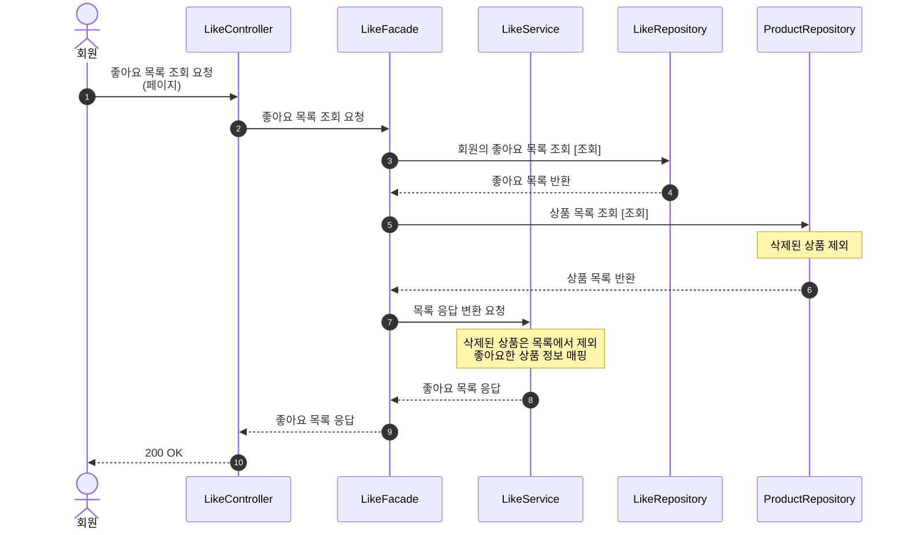
```mermaid
sequenceDiagram
    autonumber
    actor 회원
    participant Controller as LikeController
    participant Facade as LikeFacade
    participant Service as LikeService
    participant LikeRepo as LikeRepository
    participant ProductRepo as ProductRepository

    회원->>Controller: 좋아요 목록 조회 요청<br/>(페이지)
    Controller->>Facade: 좋아요 목록 조회 요청

    %% 1. 좋아요 목록 조회
    Facade->>LikeRepo: 회원의 좋아요 목록 조회 [조회]
    LikeRepo-->>Facade: 좋아요 목록 반환

    %% 2. 상품 정보 조회
    Facade->>ProductRepo: 상품 목록 조회 [조회]
    Note over ProductRepo: 삭제된 상품 제외
    ProductRepo-->>Facade: 상품 목록 반환

    %% 3. 응답 변환
    Facade->>Service: 목록 응답 변환 요청
    Note over Service: 삭제된 상품은 목록에서 제외<br/>좋아요한 상품 정보 매핑
    Service-->>Facade: 좋아요 목록 응답

    Facade-->>Controller: 좋아요 목록 응답
    Controller-->>회원: 200 OK
```

### 6.2 핵심 설계 포인트

| 단계 | 책임 객체 | 설명 |
|------|----------|------|
| 좋아요 조회 | Repository | 회원의 좋아요 목록 조회 |
| 삭제된 상품 제외 | Service | 좋아요한 상품이 삭제된 경우 목록에서 제외 |
| 페이지네이션 | Repository | 오프셋 기반 페이지 처리 |

---

## 7. 주문 내역 조회 - 회원 (시나리오 J)

### 7.1 다이어그램

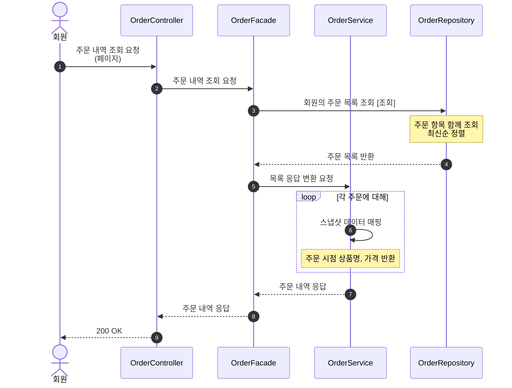
```mermaid
sequenceDiagram
    autonumber
    actor 회원
    participant Controller as OrderController
    participant Facade as OrderFacade
    participant Service as OrderService
    participant Repository as OrderRepository

    회원->>Controller: 주문 내역 조회 요청<br/>(페이지)
    Controller->>Facade: 주문 내역 조회 요청

    %% 1. 주문 목록 조회
    Facade->>Repository: 회원의 주문 목록 조회 [조회]
    Note over Repository: 주문 항목 함께 조회<br/>최신순 정렬
    Repository-->>Facade: 주문 목록 반환

    %% 2. 응답 변환
    Facade->>Service: 목록 응답 변환 요청
    loop 각 주문에 대해
        Service->>Service: 스냅샷 데이터 매핑
        Note over Service: 주문 시점 상품명, 가격 반환
    end
    Service-->>Facade: 주문 내역 응답

    Facade-->>Controller: 주문 내역 응답
    Controller-->>회원: 200 OK
```

### 7.2 핵심 설계 포인트

| 단계 | 책임 객체 | 설명 |
|------|----------|------|
| 스냅샷 반환 | Service | 주문 시점의 상품명, 가격 반환 (현재 가격 아님) |
| 정렬 | Repository | 최신 주문 순으로 정렬 |
| 페이지네이션 | Repository | 오프셋 기반 페이지 처리 |

### 7.3 스냅샷 데이터의 의미

| 필드 | 설명 |
|------|------|
| 상품명 | 주문 시점의 상품명 (이후 변경되어도 유지) |
| 옵션명 | 주문 시점의 옵션명 (이후 변경되어도 유지) |
| 가격 | 주문 시점의 가격 (이후 변경되어도 유지) |
| 수량 | 주문한 수량 |

---

## 8. 좋아요 토글 - 회원 (시나리오 E)

### 8.1 다이어그램

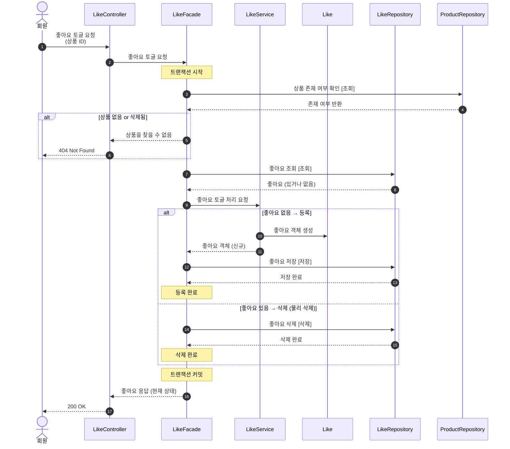
```mermaid
sequenceDiagram
    autonumber
    actor 회원
    participant Controller as LikeController
    participant Facade as LikeFacade
    participant Service as LikeService
    participant Domain as Like
    participant LikeRepo as LikeRepository
    participant ProductRepo as ProductRepository

    회원->>Controller: 좋아요 토글 요청<br/>(상품 ID)
    Controller->>Facade: 좋아요 토글 요청

    Note over Facade: 트랜잭션 시작

    %% 1. 상품 존재 확인
    Facade->>ProductRepo: 상품 존재 여부 확인 [조회]
    ProductRepo-->>Facade: 존재 여부 반환
    alt 상품 없음 or 삭제됨
        Facade-->>Controller: 상품을 찾을 수 없음
        Controller-->>회원: 404 Not Found
    end

    %% 2. 기존 좋아요 조회
    Facade->>LikeRepo: 좋아요 조회 [조회]
    LikeRepo-->>Facade: 좋아요 (있거나 없음)

    %% 3. 상태에 따른 분기 처리 (물리 삭제 방식)
    Facade->>Service: 좋아요 토글 처리 요청

    alt 좋아요 없음 → 등록
        Service->>Domain: 좋아요 객체 생성
        Service-->>Facade: 좋아요 객체 (신규)
        Facade->>LikeRepo: 좋아요 저장 [저장]
        LikeRepo-->>Facade: 저장 완료
        Note over Facade: 등록 완료
    else 좋아요 있음 → 삭제 (물리 삭제)
        Facade->>LikeRepo: 좋아요 삭제 [삭제]
        LikeRepo-->>Facade: 삭제 완료
        Note over Facade: 삭제 완료
    end

    Note over Facade: 트랜잭션 커밋

    Facade-->>Controller: 좋아요 응답 (현재 상태)
    Controller-->>회원: 200 OK
```

### 8.2 멱등성 보장 전략

| 전략 | 구현 방법 |
|------|----------|
| 데이터베이스 레벨 | 회원-상품 조합에 유일 제약조건 |
| 애플리케이션 레벨 | 기존 데이터 조회 후 있으면 삭제, 없으면 생성 |
| 동시 요청 | 트랜잭션 + 행 잠금으로 순차 처리 |

### 8.3 물리 삭제 선택 근거

| 논리 삭제 | 물리 삭제 (채택) |
|-------------|-------------------|
| 토글 시 3가지 분기 필요 (없음/활성/취소) | 토글 시 2가지 분기만 필요 (없음/있음) |
| 이력 보존 가능 | 이력 보존 불필요 (좋아요는 휘발성) |
| 쿼리 시 삭제 여부 조건 필요 | 단순 쿼리 |
| 재등록 시 복원 처리 | 재등록 시 새 레코드 생성 |

### 8.4 상태 전이 (물리 삭제 방식)

```
[없음] ─── 등록 ───> [있음]
[있음] ─── 삭제 ───> [없음]
```

---

## 9. 장바구니 담기 - 회원 (시나리오 F)

### 9.1 다이어그램

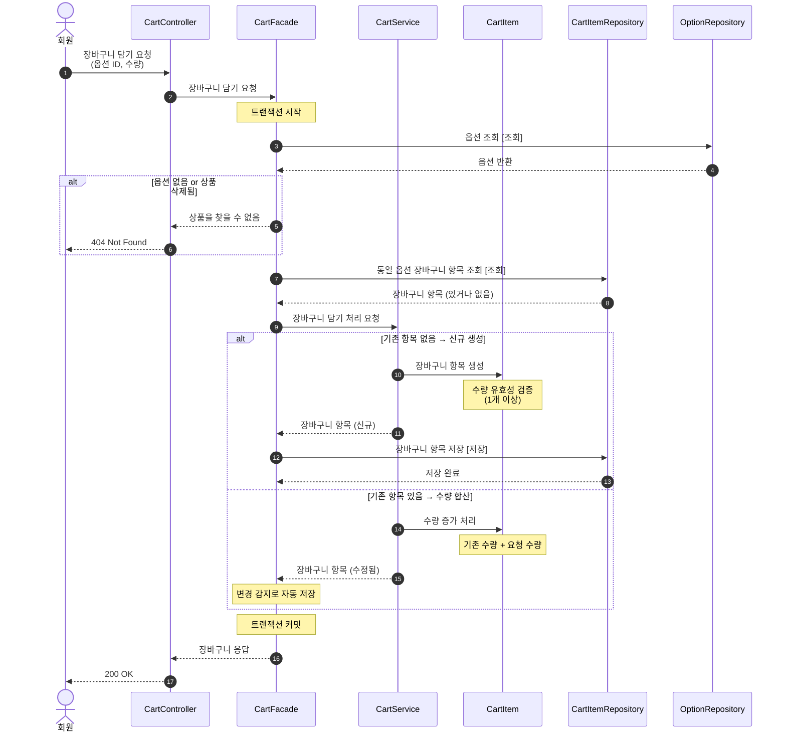
```mermaid
sequenceDiagram
    autonumber
    actor 회원
    participant Controller as CartController
    participant Facade as CartFacade
    participant Service as CartService
    participant Domain as CartItem
    participant CartRepo as CartItemRepository
    participant OptionRepo as OptionRepository

    회원->>Controller: 장바구니 담기 요청<br/>(옵션 ID, 수량)
    Controller->>Facade: 장바구니 담기 요청

    Note over Facade: 트랜잭션 시작

    %% 1. 옵션 존재 확인
    Facade->>OptionRepo: 옵션 조회 [조회]
    OptionRepo-->>Facade: 옵션 반환
    alt 옵션 없음 or 상품 삭제됨
        Facade-->>Controller: 상품을 찾을 수 없음
        Controller-->>회원: 404 Not Found
    end

    %% 2. 기존 장바구니 항목 확인
    Facade->>CartRepo: 동일 옵션 장바구니 항목 조회 [조회]
    CartRepo-->>Facade: 장바구니 항목 (있거나 없음)

    %% 3. Merge 로직 적용
    Facade->>Service: 장바구니 담기 처리 요청

    alt 기존 항목 없음 → 신규 생성
        Service->>Domain: 장바구니 항목 생성
        Note over Domain: 수량 유효성 검증<br/>(1개 이상)
        Service-->>Facade: 장바구니 항목 (신규)
        Facade->>CartRepo: 장바구니 항목 저장 [저장]
        CartRepo-->>Facade: 저장 완료
    else 기존 항목 있음 → 수량 합산
        Service->>Domain: 수량 증가 처리
        Note over Domain: 기존 수량 + 요청 수량
        Service-->>Facade: 장바구니 항목 (수정됨)
        Note over Facade: 변경 감지로 자동 저장
    end

    Note over Facade: 트랜잭션 커밋

    Facade-->>Controller: 장바구니 응답
    Controller-->>회원: 200 OK
```

### 9.2 핵심 설계 포인트

| 단계 | 책임 객체 | 설명 |
|------|----------|------|
| Merge 로직 | Service | 동일 옵션이면 수량 합산, 아니면 신규 생성 |
| 수량 검증 | Domain (VO) | 0 이하 수량 불가 |
| 옵션 검증 | Facade | 삭제된 상품/옵션은 장바구니에 담기 불가 |

### 9.3 Merge 로직

```
[장바구니에 동일 옵션 없음] → 신규 항목 생성
[장바구니에 동일 옵션 있음] → 기존 수량 + 요청 수량
```

---

## 10. 장바구니 조회 - 회원 (시나리오 F)

### 10.1 다이어그램

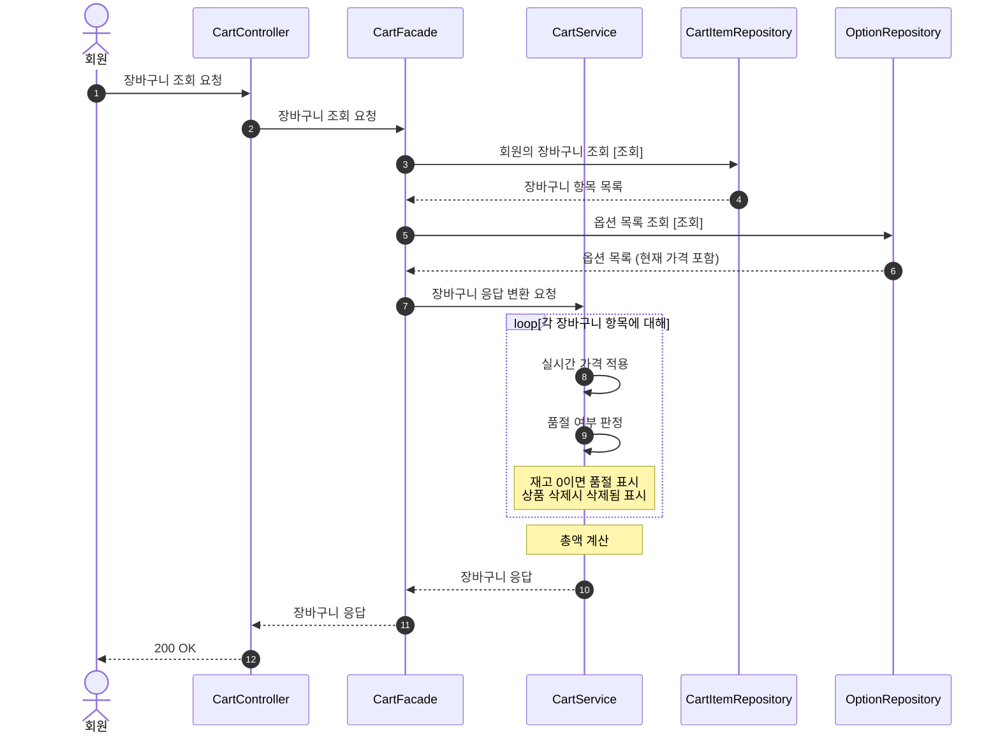
```mermaid
sequenceDiagram
    autonumber
    actor 회원
    participant Controller as CartController
    participant Facade as CartFacade
    participant Service as CartService
    participant CartRepo as CartItemRepository
    participant OptionRepo as OptionRepository

    회원->>Controller: 장바구니 조회 요청
    Controller->>Facade: 장바구니 조회 요청

    %% 1. 장바구니 항목 조회
    Facade->>CartRepo: 회원의 장바구니 조회 [조회]
    CartRepo-->>Facade: 장바구니 항목 목록

    %% 2. 옵션 정보 조회 (실시간 가격)
    Facade->>OptionRepo: 옵션 목록 조회 [조회]
    OptionRepo-->>Facade: 옵션 목록 (현재 가격 포함)

    %% 3. 응답 변환
    Facade->>Service: 장바구니 응답 변환 요청
    loop 각 장바구니 항목에 대해
        Service->>Service: 실시간 가격 적용
        Service->>Service: 품절 여부 판정
        Note over Service: 재고 0이면 품절 표시<br/>상품 삭제시 삭제됨 표시
    end
    Note over Service: 총액 계산
    Service-->>Facade: 장바구니 응답

    Facade-->>Controller: 장바구니 응답
    Controller-->>회원: 200 OK
```

### 10.2 핵심 설계 포인트

| 단계 | 책임 객체 | 설명 |
|------|----------|------|
| 실시간 가격 | Service | 장바구니 조회 시 현재 옵션 가격 반영 |
| 품절 표시 | Service | 재고 0인 옵션은 품절로 표시 |
| 삭제 상품 표시 | Service | 삭제된 상품은 "삭제된 상품" 표시 |
| 총액 계산 | Service | 현재 가격 기준 총액 계산 |

### 10.3 장바구니 vs 주문의 가격

| 시점 | 가격 |
|------|------|
| 장바구니 조회 | 실시간 현재 가격 |
| 주문 완료 | 스냅샷 (주문 시점 가격 고정) |

---

## 11. 주문 생성 - 장바구니 주문 (시나리오 G, H, I)

### 11.1 다이어그램

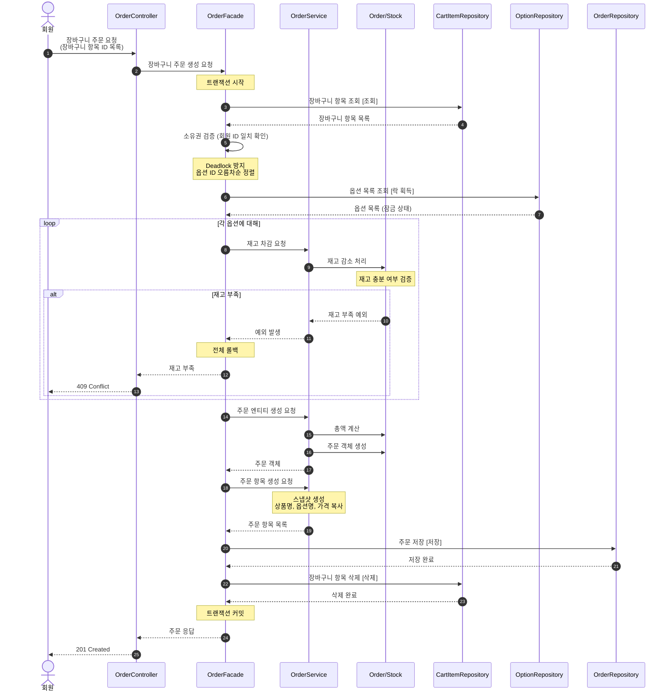
```mermaid
sequenceDiagram
    autonumber
    actor 회원
    participant Controller as OrderController
    participant Facade as OrderFacade
    participant Service as OrderService
    participant Domain as Order/Stock
    participant CartRepo as CartItemRepository
    participant OptionRepo as OptionRepository
    participant OrderRepo as OrderRepository

    회원->>Controller: 장바구니 주문 요청<br/>(장바구니 항목 ID 목록)
    Controller->>Facade: 장바구니 주문 생성 요청

    Note over Facade: 트랜잭션 시작

    %% 1. 장바구니 조회 및 소유권 검증
    Facade->>CartRepo: 장바구니 항목 조회 [조회]
    CartRepo-->>Facade: 장바구니 항목 목록
    Facade->>Facade: 소유권 검증 (회원 ID 일치 확인)

    %% 2. 옵션 조회 (Lock)
    Note over Facade: Deadlock 방지<br/>옵션 ID 오름차순 정렬
    Facade->>OptionRepo: 옵션 목록 조회 [락 획득]
    OptionRepo-->>Facade: 옵션 목록 (잠금 상태)

    %% 3. 재고 차감
    loop 각 옵션에 대해
        Facade->>Service: 재고 차감 요청
        Service->>Domain: 재고 감소 처리
        Note over Domain: 재고 충분 여부 검증
        alt 재고 부족
            Domain-->>Service: 재고 부족 예외
            Service-->>Facade: 예외 발생
            Note over Facade: 전체 롤백
            Facade-->>Controller: 재고 부족
            Controller-->>회원: 409 Conflict
        end
    end

    %% 4. 주문 생성
    Facade->>Service: 주문 엔티티 생성 요청
    Service->>Domain: 총액 계산
    Service->>Domain: 주문 객체 생성
    Service-->>Facade: 주문 객체

    %% 5. 스냅샷 저장
    Facade->>Service: 주문 항목 생성 요청
    Note over Service: 스냅샷 생성<br/>상품명, 옵션명, 가격 복사
    Service-->>Facade: 주문 항목 목록

    Facade->>OrderRepo: 주문 저장 [저장]
    OrderRepo-->>Facade: 저장 완료

    %% 6. 장바구니 정리
    Facade->>CartRepo: 장바구니 항목 삭제 [삭제]
    CartRepo-->>Facade: 삭제 완료

    Note over Facade: 트랜잭션 커밋

    Facade-->>Controller: 주문 응답
    Controller-->>회원: 201 Created
```

### 11.2 핵심 설계 포인트

| 단계 | 책임 객체 | 설명 |
|------|----------|------|
| 트랜잭션 경계 | Facade | 원자성 보장 (All or Nothing) |
| 소유권 검증 | Facade | 타인의 장바구니 접근 차단 |
| Deadlock 방지 | Facade | 옵션 ID 오름차순 정렬 후 잠금 |
| 재고 차감 | Domain (Stock VO) | 부족 시 예외 발생 |
| 스냅샷 생성 | Service | 주문 항목에 현재 가격/이름 복사 |

---

## 12. 주문 생성 - 바로 구매 (시나리오 K)

### 12.1 다이어그램

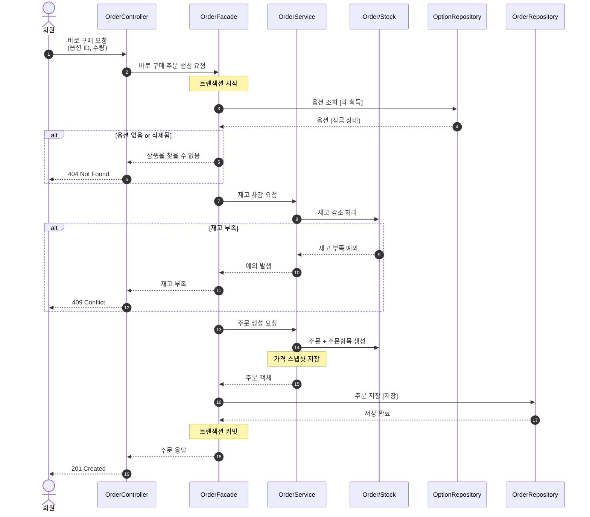
```mermaid
sequenceDiagram
    autonumber
    actor 회원
    participant Controller as OrderController
    participant Facade as OrderFacade
    participant Service as OrderService
    participant Domain as Order/Stock
    participant OptionRepo as OptionRepository
    participant OrderRepo as OrderRepository

    회원->>Controller: 바로 구매 요청<br/>(옵션 ID, 수량)
    Controller->>Facade: 바로 구매 주문 생성 요청

    Note over Facade: 트랜잭션 시작

    %% 1. 옵션 조회 (Lock)
    Facade->>OptionRepo: 옵션 조회 [락 획득]
    OptionRepo-->>Facade: 옵션 (잠금 상태)

    alt 옵션 없음 or 삭제됨
        Facade-->>Controller: 상품을 찾을 수 없음
        Controller-->>회원: 404 Not Found
    end

    %% 2. 재고 차감
    Facade->>Service: 재고 차감 요청
    Service->>Domain: 재고 감소 처리
    alt 재고 부족
        Domain-->>Service: 재고 부족 예외
        Service-->>Facade: 예외 발생
        Facade-->>Controller: 재고 부족
        Controller-->>회원: 409 Conflict
    end

    %% 3. 주문 생성 + 스냅샷
    Facade->>Service: 주문 생성 요청
    Service->>Domain: 주문 + 주문항목 생성
    Note over Service: 가격 스냅샷 저장
    Service-->>Facade: 주문 객체

    Facade->>OrderRepo: 주문 저장 [저장]
    OrderRepo-->>Facade: 저장 완료

    Note over Facade: 트랜잭션 커밋

    Facade-->>Controller: 주문 응답
    Controller-->>회원: 201 Created
```

### 12.2 장바구니 주문과의 차이점

| 항목 | 장바구니 주문 | 바로 구매 |
|------|-------------|----------|
| 입력 | 장바구니 항목 ID 목록 | 옵션 ID, 수량 |
| 장바구니 조회 | O | X |
| 장바구니 정리 | O | X (장바구니 미사용) |
| 잠금 대상 | 여러 옵션 (정렬 필요) | 단일 옵션 |

---

## 13. 주문 취소 (시나리오 L)

### 13.1 다이어그램

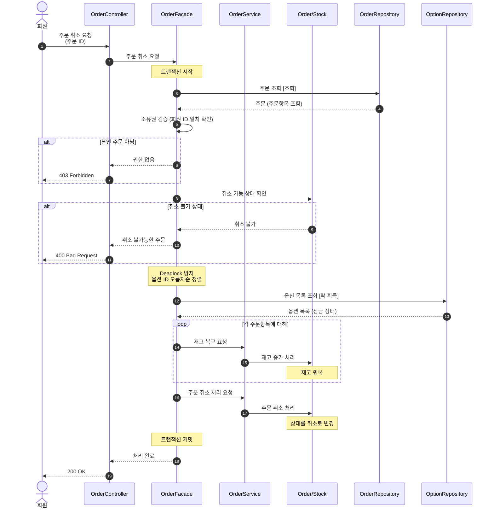
```mermaid
sequenceDiagram
    autonumber
    actor 회원
    participant Controller as OrderController
    participant Facade as OrderFacade
    participant Service as OrderService
    participant Domain as Order/Stock
    participant OrderRepo as OrderRepository
    participant OptionRepo as OptionRepository

    회원->>Controller: 주문 취소 요청<br/>(주문 ID)
    Controller->>Facade: 주문 취소 요청

    Note over Facade: 트랜잭션 시작

    %% 1. 주문 조회 및 검증
    Facade->>OrderRepo: 주문 조회 [조회]
    OrderRepo-->>Facade: 주문 (주문항목 포함)

    Facade->>Facade: 소유권 검증 (회원 ID 일치 확인)
    alt 본인 주문 아님
        Facade-->>Controller: 권한 없음
        Controller-->>회원: 403 Forbidden
    end

    Facade->>Domain: 취소 가능 상태 확인
    alt 취소 불가 상태
        Domain-->>Facade: 취소 불가
        Facade-->>Controller: 취소 불가능한 주문
        Controller-->>회원: 400 Bad Request
    end

    %% 2. 재고 복구
    Note over Facade: Deadlock 방지<br/>옵션 ID 오름차순 정렬
    Facade->>OptionRepo: 옵션 목록 조회 [락 획득]
    OptionRepo-->>Facade: 옵션 목록 (잠금 상태)

    loop 각 주문항목에 대해
        Facade->>Service: 재고 복구 요청
        Service->>Domain: 재고 증가 처리
        Note over Domain: 재고 원복
    end

    %% 3. 주문 상태 변경
    Facade->>Service: 주문 취소 처리 요청
    Service->>Domain: 주문 취소 처리
    Note over Domain: 상태를 취소로 변경

    Note over Facade: 트랜잭션 커밋

    Facade-->>Controller: 처리 완료
    Controller-->>회원: 200 OK
```

### 13.2 핵심 설계 포인트

| 단계 | 책임 객체 | 설명 |
|------|----------|------|
| 취소 가능 검증 | Domain (Order) | 완료 상태인 경우만 취소 가능 |
| 재고 복구 | Domain (Stock VO) | 주문 수량만큼 재고 증가 |
| 상태 변경 | Domain (Order) | 취소 상태로 변경 |
| 부분 취소 | 미지원 | 전체 주문 단위로만 취소 |
