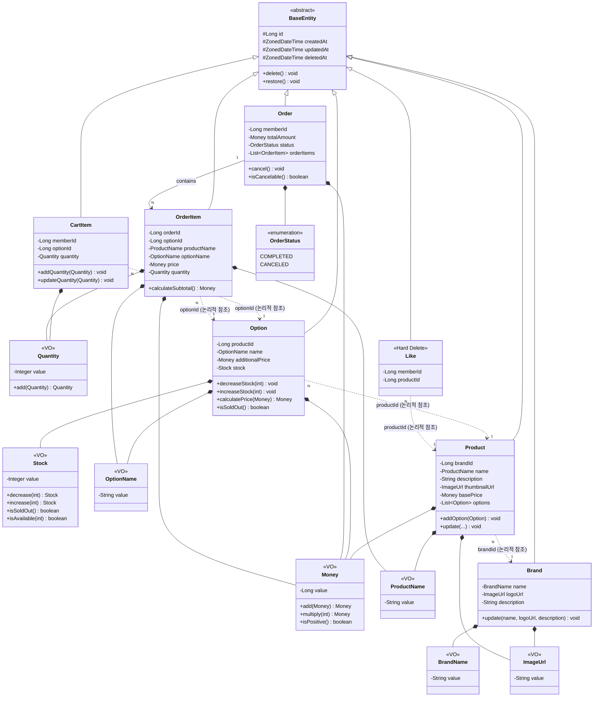

# 📐 03. 클래스 다이어그램 (Class Diagram)

## 1. 전체 도메인 클래스 다이어그램



---

## 2. Value Object 설계

### 2.1 VO 목록 및 책임

| VO | 책임 | 핵심 규칙 |
|----|------|----------|
| **Money** | 금액 표현 및 연산 | 0원 이상, 불변, 덧셈/곱셈 연산 제공 |
| **Stock** | 재고 수량 관리 | 0개 이상, 불변, 차감 시 부족하면 예외 |
| **Quantity** | 주문/장바구니 수량 | 1개 이상, 불변 |
| **BrandName** | 브랜드명 | 필수값, 100자 이내 |
| **ProductName** | 상품명 | 필수값, 100자 이내 |
| **OptionName** | 옵션명 | 필수값, 100자 이내 |
| **ImageUrl** | 이미지 URL | URL 형식 검증 |

### 2.2 VO 설계 원칙

| 원칙 | 설명 |
|------|------|
| **불변성 (Immutability)** | 생성 후 값 변경 불가. 연산 시 새 객체 반환. |
| **자가 검증 (Self-Validation)** | 생성자에서 유효성 검증. 잘못된 값으로 생성 불가. |
| **동등성 (Equality)** | 값이 같으면 같은 객체로 취급 |

---

## 3. Entity 설계

### 3.1 Entity 목록 및 책임

| Entity | 책임 | 특이사항 |
|--------|------|----------|
| **Brand** | 브랜드 정보 관리 | Soft Delete, 삭제 시 하위 상품 Cascade |
| **Product** | 상품 메타정보 관리 | Soft Delete, 옵션과 1:N 관계 |
| **Option** | 실제 판매 단위 관리 | Soft Delete, 재고 보유 |
| **Like** | 회원-상품 관심 표시 | **Hard Delete**, 이력 미보존 |
| **CartItem** | 장바구니 항목 | Hard Delete, 임시 데이터 |
| **Order** | 주문 정보 | 삭제 불가, 취소만 가능 |
| **OrderItem** | 주문 상세 (스냅샷) | 삭제 불가, 원본 변경과 무관 |

### 3.2 Entity 설계 원칙

| 원칙 | 설명 |
|------|------|
| **풍부한 도메인 모델** | 비즈니스 로직을 Entity 내부에 캡슐화 |
| **Setter 금지** | 상태 변경은 의미 있는 도메인 메서드로만 수행 |
| **VO 활용** | 원시값 대신 VO로 감싸서 타입 안전성 확보 |

---

## 4. 서비스 레이어 구조

### 4.1 패키지 구조 (Admin/Member 분리)

```
com.loopers
├── domain
│   ├── brand
│   │   ├── Brand
│   │   ├── BrandRepository
│   │   ├── BrandService (순수 비즈니스 로직)
│   │   └── vo/
│   │       └── BrandName
│   ├── product
│   │   ├── Product
│   │   ├── Option
│   │   ├── ProductRepository
│   │   ├── OptionRepository
│   │   ├── ProductService (순수 비즈니스 로직)
│   │   └── vo/
│   │       ├── ProductName
│   │       ├── OptionName
│   │       ├── Money
│   │       └── Stock
│   ├── like
│   │   ├── Like
│   │   ├── LikeRepository
│   │   └── LikeService (순수 비즈니스 로직)
│   ├── cart
│   │   ├── CartItem
│   │   ├── CartItemRepository
│   │   ├── CartService (순수 비즈니스 로직)
│   │   └── vo/
│   │       └── Quantity
│   └── order
│       ├── Order
│       ├── OrderItem
│       ├── OrderStatus
│       ├── OrderRepository
│       └── OrderService (순수 비즈니스 로직)
│
├── application
│   ├── admin                          # 관리자 전용
│   │   ├── brand/
│   │   │   └── AdminBrandFacade
│   │   └── product/
│   │       └── AdminProductFacade
│   │
│   └── member                         # 회원 전용
│       ├── product/
│       │   └── ProductFacade          # 조회 전용
│       ├── like/
│       │   └── LikeFacade
│       ├── cart/
│       │   └── CartFacade
│       └── order/
│           └── OrderFacade
│
├── interfaces
│   ├── api
│   │   ├── admin                      # /api/admin/**
│   │   │   ├── AdminBrandController
│   │   │   └── AdminProductController
│   │   │
│   │   └── member                     # /api/v1/**
│   │       ├── ProductController
│   │       ├── LikeController
│   │       ├── CartController
│   │       └── OrderController
│   │
│   └── resolver/
│       └── LoginMemberArgumentResolver
│
└── config
    └── DomainConfig
```

### 4.2 Admin/Member 분리 근거

| 관점 | 설명 |
|------|------|
| **책임 분리** | Admin은 "데이터 관리", Member는 "거래 활동" - 성격이 다름 |
| **보안 경계** | URL 패턴으로 인증/인가 정책 분리 가능 |
| **확장 용이** | Admin에 대량 업로드, 통계 등 추가 시 Member 코드 영향 없음 |
| **팀 협업** | 백오피스팀 / 서비스팀 분리 개발 가능 |

---

## 5. 책임 분배 요약

| 구분 | 책임 | 예시 |
|------|------|------|
| **VO** | 유효성 검증, 불변식 보장, 연산 | Stock 차감, Money 덧셈 |
| **Entity** | 상태 변경, 도메인 메서드 | Order 취소, Option 재고 차감 |
| **Service (POJO)** | 비즈니스 로직 조합 | 스냅샷 생성, 총액 계산 |
| **Facade** | 트랜잭션, Repository 조율 | 잠금 획득, 저장, 삭제 |

---

## 6. 설계 결정 사항 (Design Decisions)

### 6.1 논리적 FK (물리적 제약조건 미적용)

| 대상 | 물리적 FK | 근거 |
|------|----------|------|
| Product → Brand | 미적용 | Soft Delete 시 참조 무결성 충돌 방지 |
| Like → Member/Product | 미적용 | 애플리케이션 레벨 검증으로 충분 |
| CartItem → Option | 미적용 | 옵션 삭제 시에도 장바구니 유지 필요 |
| OrderItem → Option | 미적용 | 스냅샷이 주 데이터, 참조는 부가 정보 |
| OrderItem → Order | **적용** | 강한 결합 (Aggregate Root) |

### 6.2 삭제 정책

| 도메인 | 삭제 방식 | 근거 |
|--------|----------|------|
| **Like** | Hard Delete | 이력 보존 가치 낮음, 토글 로직 단순화 |
| CartItem | Hard Delete | 임시 데이터 |
| 나머지 | Soft Delete | 이력 보존, 참조 관계 유지 |

