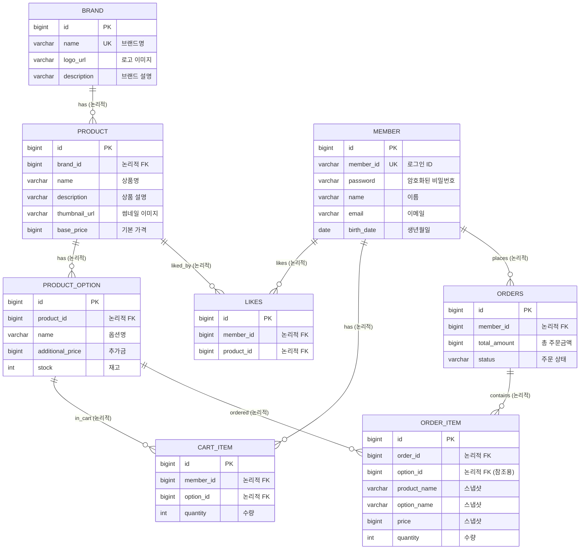

# 🗄️ 04. ERD (Entity Relationship Diagram)

### 핵심 설계 원칙

| 원칙 | 설명 |
|------|------|
| **논리적 FK** | 모든 테이블 간 관계에서 물리적 제약조건 미적용 |
| **Soft Delete** | 대부분의 테이블에 삭제일시 컬럼 적용 (예외: Like, CartItem, Order) |
| **스냅샷** | OrderItem에 주문 시점 데이터 복사 저장 |

---

## 1. 전체 ERD

> **Relation:** 모든 관계선은 **논리적 연결**을 의미하며, 물리적 FK 제약조건은 적용하지 않음



> **참고:** 모든 Entity는 `BaseEntity`를 상속받아 `id`, `created_at`, `updated_at`, `deleted_at` 컬럼을 공통으로 가짐 (다이어그램에서는 생략)

---

## 2. 테이블 상세 정의

### 2.1 BRAND (브랜드)

| 컬럼명 | 타입 | 제약조건 | 설명 |
|--------|------|----------|------|
| id | BIGINT | PK | 브랜드 고유 식별자 |
| name | VARCHAR(100) | UNIQUE, NOT NULL | 브랜드명 |
| logo_url | VARCHAR(500) | NULLABLE | 로고 이미지 URL |
| description | VARCHAR(500) | NULLABLE | 브랜드 설명 |

**인덱스:**
- 브랜드명 유일 인덱스

**Relation:** 논리적 연결 (물리적 FK 없음)

---

### 2.2 PRODUCT (상품)

| 컬럼명 | 타입 | 제약조건 | 설명 |
|--------|------|----------|------|
| id | BIGINT | PK | 상품 고유 식별자 |
| brand_id | BIGINT | NOT NULL | 귀속 브랜드 ID |
| name | VARCHAR(100) | NOT NULL | 상품명 |
| description | VARCHAR(2000) | NULLABLE | 상품 설명 |
| thumbnail_url | VARCHAR(500) | NULLABLE | 썸네일 이미지 URL |
| base_price | BIGINT | NOT NULL | 기본 가격 (원) |

**인덱스:**
- brand_id 인덱스 (브랜드별 상품 조회)
- deleted_at 인덱스 (활성 상품 필터링)

**Relation:** 논리적 연결 (물리적 FK 없음)
- brand_id → BRAND: Soft Delete 시 참조 무결성 충돌 방지

---

### 2.3 PRODUCT_OPTION (상품 옵션)

| 컬럼명 | 타입 | 제약조건 | 설명 |
|--------|------|----------|------|
| id | BIGINT | PK | 옵션 고유 식별자 |
| product_id | BIGINT | NOT NULL | 상품 ID |
| name | VARCHAR(100) | NOT NULL | 옵션명 (예: 260, 270) |
| additional_price | BIGINT | NOT NULL, DEFAULT 0 | 추가 금액 |
| stock | INT | NOT NULL, CHECK >= 0 | 재고 수량 |

**인덱스:**
- product_id 인덱스 (상품별 옵션 조회)

**CHECK:**
- stock >= 0 (재고 음수 방지)

**Relation:** 논리적 연결 (물리적 FK 없음)

---

### 2.4 LIKES (좋아요) - **Hard Delete**

| 컬럼명 | 타입 | 제약조건 | 설명 |
|--------|------|----------|------|
| id | BIGINT | PK | 좋아요 고유 식별자 |
| member_id | BIGINT | NOT NULL | 회원 ID |
| product_id | BIGINT | NOT NULL | 상품 ID |

**인덱스:**
- (member_id, product_id) 유일 인덱스 (중복 좋아요 방지)
- member_id 인덱스

**삭제 정책:**
- **Hard Delete 적용**: deleted_at 컬럼 없음
- 좋아요 취소 시 레코드 물리 삭제
- 재등록 시 새 레코드 생성

**Relation:** 논리적 연결 (물리적 FK 없음)

---

### 2.5 CART_ITEM (장바구니)

| 컬럼명 | 타입 | 제약조건 | 설명 |
|--------|------|----------|------|
| id | BIGINT | PK | 장바구니 항목 고유 식별자 |
| member_id | BIGINT | NOT NULL | 회원 ID |
| option_id | BIGINT | NOT NULL | 옵션 ID |
| quantity | INT | NOT NULL, CHECK >= 1 | 수량 |

**인덱스:**
- (member_id, option_id) 유일 인덱스 (Merge 로직 지원)
- member_id 인덱스

**CHECK:**
- quantity >= 1

**특이사항:**
- deleted_at 없음 (물리 삭제)
- Merge 로직: 동일 옵션 담기 시 수량 합산

**Relation:** 논리적 연결 (물리적 FK 없음)

---

### 2.6 ORDERS (주문)

| 컬럼명 | 타입 | 제약조건 | 설명 |
|--------|------|----------|------|
| id | BIGINT | PK | 주문 고유 식별자 |
| member_id | BIGINT | NOT NULL | 주문자 ID |
| total_amount | BIGINT | NOT NULL | 총 주문 금액 |
| status | VARCHAR(20) | NOT NULL | 주문 상태 |

**인덱스:**
- member_id 인덱스 (내 주문 목록 조회)
- created_at 인덱스 (주문 일시 정렬)

**상태 값:**
- COMPLETED: 주문 완료
- CANCELED: 주문 취소

**특이사항:**
- deleted_at 없음 (삭제 불가, 이력 보존 필수)

**Relation:** 논리적 연결 (물리적 FK 없음)

---

### 2.7 ORDER_ITEM (주문 상세)

| 컬럼명 | 타입 | 제약조건 | 설명 |
|--------|------|----------|------|
| id | BIGINT | PK | 주문 상세 고유 식별자 |
| order_id | BIGINT | NOT NULL | 주문 ID |
| option_id | BIGINT | NOT NULL | 옵션 ID (참조용) |
| product_name | VARCHAR(100) | NOT NULL | 주문 시점 상품명 (스냅샷) |
| option_name | VARCHAR(100) | NOT NULL | 주문 시점 옵션명 (스냅샷) |
| price | BIGINT | NOT NULL | 주문 시점 가격 (스냅샷) |
| quantity | INT | NOT NULL | 주문 수량 |

**인덱스:**
- order_id 인덱스 (주문별 상세 조회)

**스냅샷 정책:**
- product_name, option_name, price는 주문 시점 값 복사
- 원본(Product, Option)이 변경/삭제되어도 주문 내역 유지

**Relation:** 논리적 연결 (물리적 FK 없음)
- order_id → ORDERS: 논리적 연결

---

## 3. 데이터 정합성 설계

### 3.1 재고 정합성

| 정책 | 구현 방법 |
|------|----------|
| 재고 음수 방지 | CHECK 제약 + 애플리케이션 레벨 검증 |
| 동시성 제어 | 비관적 락 (조회 시 잠금 획득) |
| Deadlock 방지 | 옵션 ID 오름차순 정렬 후 잠금 획득 |
| All or Nothing | 트랜잭션 + 예외 시 전체 롤백 |

### 3.2 삭제 정책 요약

| 테이블 | 삭제 방식 | deleted_at | 이유 |
|--------|----------|-------------|------|
| BRAND | Soft Delete | O | 이력 보존, Cascade 처리 |
| PRODUCT | Soft Delete | O | 주문 내역 참조 가능성 |
| PRODUCT_OPTION | Soft Delete | O | 주문 내역 참조 가능성 |
| **LIKES** | **Hard Delete** | **X** | 이력 보존 가치 낮음, 토글 로직 단순화 |
| CART_ITEM | Hard Delete | X | 임시 데이터, 물리 삭제 |
| ORDERS | 삭제 불가 | X | 삭제 자체 불가, 이력 필수 보존 |
| ORDER_ITEM | 삭제 불가 | X | 삭제 자체 불가, 이력 필수 보존 |

### 3.3 Cascade 정책

```
Brand 삭제 시:
├── Product 논리 삭제 (Cascade Soft Delete)
│   ├── Option은 별도 처리 없음 (Product 조회 시 필터링)
│   └── 장바구니의 해당 옵션은 주문불가 상태로 표시
└── 기존 주문 내역은 스냅샷으로 유지
```

---

## 4. 인덱스 전략 요약

| 테이블 | 인덱스 | 용도 |
|--------|--------|------|
| BRAND | 브랜드명 UNIQUE | 브랜드명 중복 검사 |
| PRODUCT | brand_id | 브랜드별 상품 조회 |
| PRODUCT | deleted_at | 활성 상품만 필터링 |
| PRODUCT_OPTION | product_id | 상품별 옵션 조회 |
| LIKES | (member_id, product_id) UNIQUE | 중복 좋아요 방지, 조회 |
| CART_ITEM | (member_id, option_id) UNIQUE | Merge 로직 지원 |
| ORDERS | member_id | 내 주문 목록 조회 |
| ORDERS | created_at | 주문 일시 정렬 |
| ORDER_ITEM | order_id | 주문별 상세 조회 |

---

## 5. 설계 결정 기록 (Design Decision Record)

### DDR-001: 물리적 FK 미적용

| 항목 | 내용 |
|------|------|
| **결정** | 모든 테이블 간 관계에서 물리적 제약조건 미적용 |
| **맥락** | Soft Delete 사용 시 참조 무결성 충돌 발생 가능, 대용량 트래픽 시 FK 검증 오버헤드 |
| **근거** | 1. Brand Soft Delete 시 Product FK 검증 실패 방지<br/>2. 옵션 삭제 후에도 장바구니/주문 데이터 유지 필요<br/>3. 애플리케이션 레벨에서 충분한 검증 가능 |
| **대안** | 모든 FK 적용 후 삭제 순서 관리 → 복잡도 증가로 기각 |

### DDR-002: Like Hard Delete

| 항목 | 내용 |
|------|------|
| **결정** | Like 테이블에 Soft Delete 대신 Hard Delete 적용 |
| **맥락** | 좋아요 토글 기능에서 Soft Delete 시 3가지 상태(없음/활성/취소) 관리 필요 |
| **근거** | 1. 좋아요 이력 보존 비즈니스 가치 낮음<br/>2. 토글 로직 단순화 (있으면 삭제, 없으면 생성)<br/>3. 쿼리 시 삭제 여부 조건 불필요 |
| **트레이드오프** | 이력 분석 불가 → 필요 시 별도 이벤트 로깅으로 대응 가능 |

### DDR-003: 스냅샷 전략

| 항목 | 내용 |
|------|------|
| **결정** | OrderItem에 주문 시점의 상품명, 옵션명, 가격을 값으로 복사 저장 |
| **맥락** | 상품 정보 변경/삭제 후에도 주문 내역 조회 필요 |
| **근거** | 1. 원본 데이터 변경이 과거 주문에 영향 미치면 안 됨<br/>2. JOIN 없이 주문 내역 조회 가능 (성능)<br/>3. 법적 거래 기록 보존 요건 충족 |
| **트레이드오프** | 데이터 중복 저장 → 주문 내역 데이터 크기 증가 (수용 가능) |

